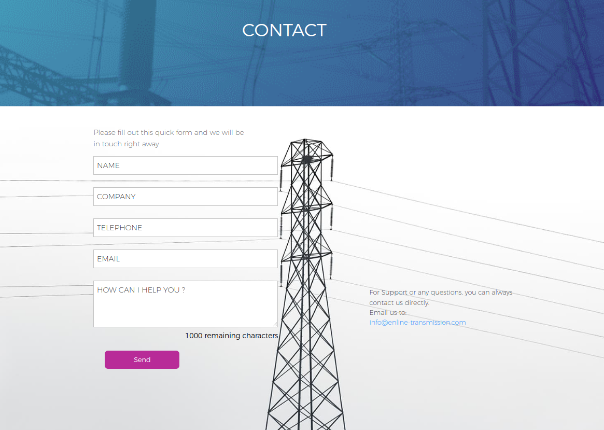

# Desafio QA Enline

Este teste terá como base a <a href='https://www.enline-transmission.com/'>pagina de Marketing da Enline</a>. 

Por favor, envie a solução do desafio para o email paulo.andrade@enline-transmission.com, com o titulo: <u> Desafio QA Enline - seu nome </u>. Qualquer duvida relacionada ao teste, encaminhar no mesmo email.

<h2> Teste 1 </h2>

Suponha que a historia abaixo foi desenvolvida pelo time de dev da Enline. Escreva pelo menos 10 casos de teste para essa historia.

<b>
Eu, como potencial cliente, gostaria de entrar em contato com o time da Enline através do site, para entender melhor sobre os serviços disponível.
</b>

Critérios de aceite:

<ul>
    <li> Os campos Name e Email devem ser obrigatorios. </li>
    <li> O campo "How Can I Help You?" deve conter no máximo 1000 caracteres. </li>
    <li> Ao clicar em info@enline-transmission.com, devera abrir o cliente de email default do cliente. </li>
    <li> Ao clicar em "Send", devera chamar a API da Enline e apresentar um Toast Verde, caso tenha sucesso, ou um toast vermelho caso contrario.</li>
</ul>

Prototipo:

<h2> Teste 2 </h2>

Considere um dos casos de teste escritos por você. Suponha que, durante o teste desse caso, foi encontrado um erro. Como você escreveria o Bugfix relacionado, para enviar de a esteira de desenvolvimento?

<h2> Teste 3 </h2>

Suponha que o front-end fosse desenvolvido em uma historia separada, a ser testada posteriormente. Dessa forma, o único serviço disponível para testes seria uma API REST com autenticação via Bearer Token. Quais ferramentas você usaria para realizar esses testes de API? Envie uma captura de tela mostrando uma simulação de como você o faria, com o token configurado.

<h2> Teste 4 </h2>

Redija, em ingles e ate 600 caracteres, uma breve apresentação de sua carreira, formação e expectativas de trabalho.